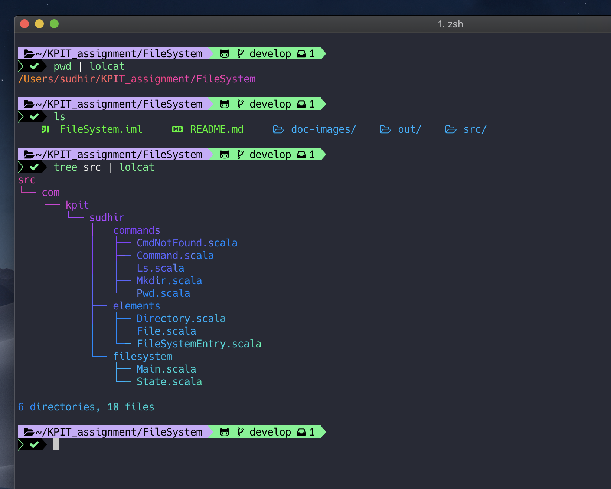
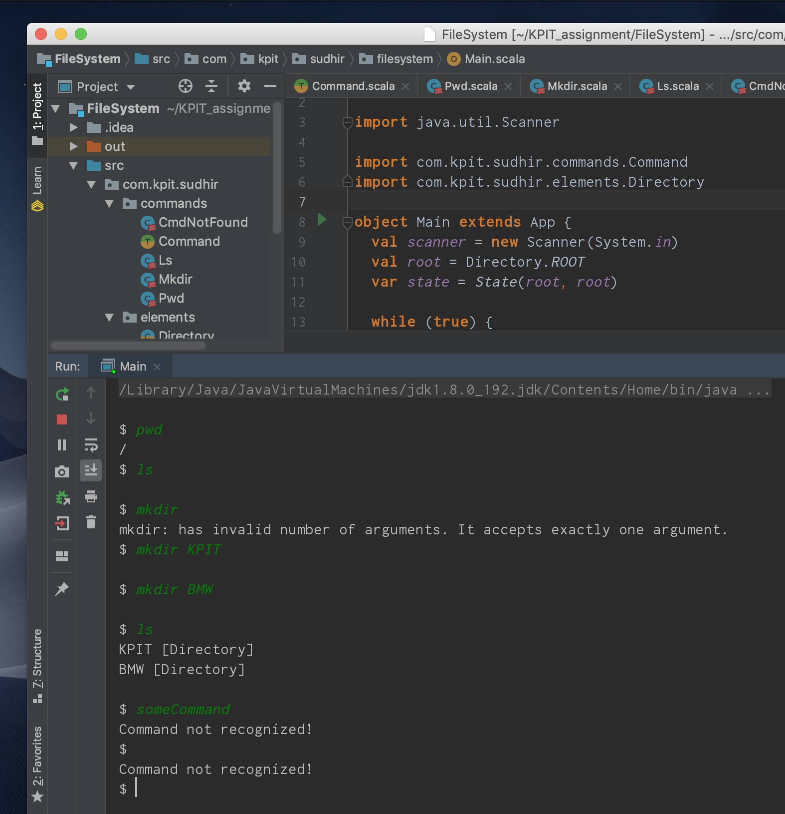

# FileSystem Interface
> Implements simple FileSystem commands. Supported commands: pwd, ls and mkdir.

## Development Env

Project can be imported as a regular scala project inside IntelliJ IDEA.

![Java Version][java-image]

![Scala Version][scala-image]

![Downloads Stats][macos-image]

![IntelliJ][intellij-image]

## Packages Structure

## Example Output

<!-- Markdown link & img dfn's -->
[scala-image]: https://img.shields.io/badge/Scala%20SDK-V%202.11.12-orange.svg
[intellij-image]: https://img.shields.io/badge/IntelliJ%20IDEA-IDEA%202018.3.2%20(Community%20Edition)-orange.svg
[macos-image]: https://img.shields.io/badge/macOS%20Mojave-V%2010.14.2-orange.svg
[java-image]: https://img.shields.io/badge/Java%20SDK-V%201.8-orange.svg
